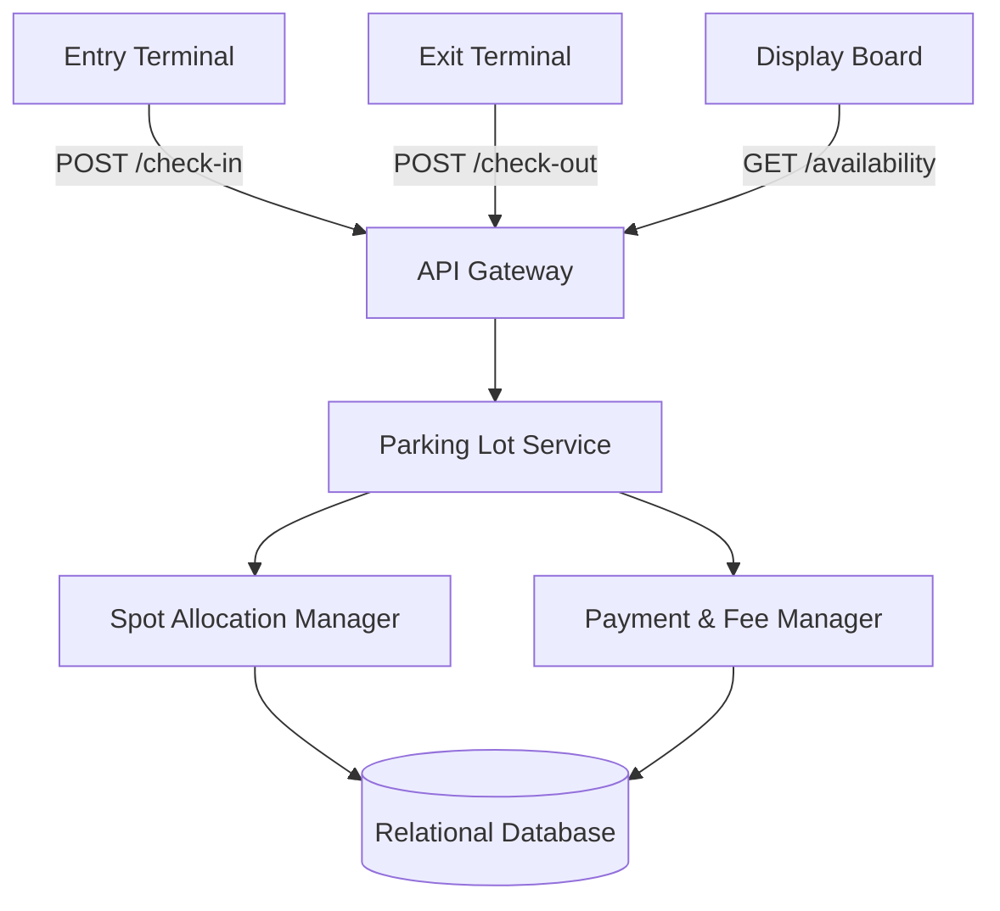
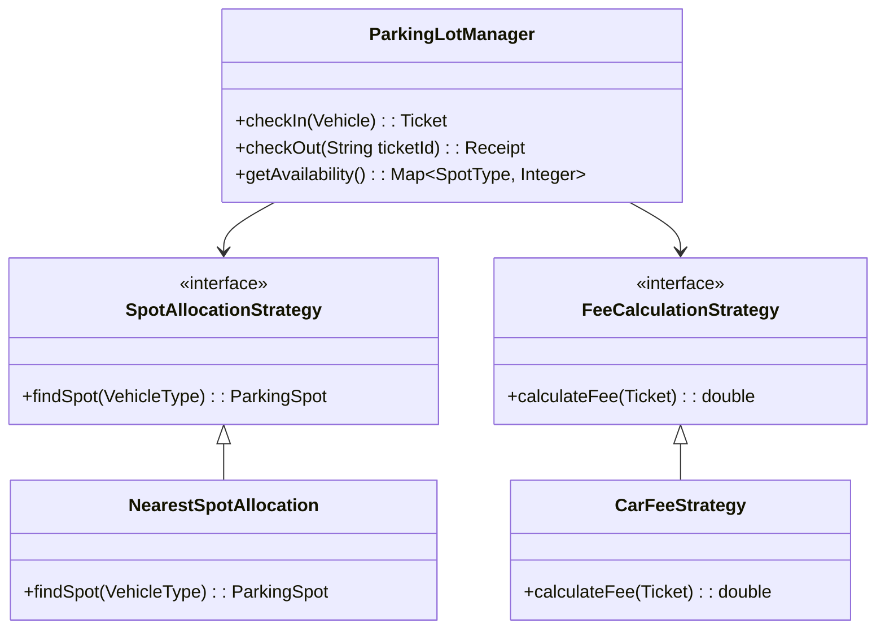

# Smart Parking Lot - Detailed Architecture

## 1. High-Level Architecture Overview
The system exposes RESTful APIs to the parking lot entry and exit terminals. The core backend processes these requests, manages state via a relational database (ensuring ACID properties for transactional safety), and handles concurrent check-in/check-out requests.

*Additionally, this project integrates the **Groq LLM** to power intelligent features, such as processing natural language queries for availability and analyzing parking lot trends at high speeds.*



## 2. Data Model (Entity-Relationship)

A relational database (like PostgreSQL or MySQL) is ideal here to strictly manage transactional states and inventory (spots).

### Entities & Enums
- **VehicleType**: `MOTORCYCLE`, `CAR`, `BUS`
- **SpotType**: `SMALL`, `MEDIUM`, `LARGE`
- **SpotStatus**: `AVAILABLE`, `OCCUPIED`, `OUT_OF_SERVICE`
- **TicketStatus**: `ACTIVE`, `COMPLETED`

### Database Schema

**1. `parking_spot`**
- `id` (UUID, Primary Key)
- `floor_number` (Integer)
- `spot_number` (Integer)
- `spot_type` (Enum: SMALL, MEDIUM, LARGE)
- `status` (Enum: AVAILABLE, OCCUPIED)
- `version` (Integer) -> *Used for Optimistic Locking*

**2. `vehicle`**
- `license_plate` (String, Primary Key)
- `vehicle_type` (Enum: MOTORCYCLE, CAR, BUS)

**3. `ticket` (Transaction)**
- `id` (UUID, Primary Key)
- `license_plate` (Foreign Key -> vehicle.license_plate)
- `spot_id` (Foreign Key -> parking_spot.id)
- `entry_time` (Timestamp)
- `exit_time` (Timestamp, Nullable)
- `status` (Enum: ACTIVE, COMPLETED)
- `fee` (Decimal, Nullable)

## 3. Low-Level Design (Core Classes)

We implement solid design patterns. **Strategy Pattern** for dynamic fee calculation, and **Factory Pattern** for spot allocation logic.



## 4. Algorithms

### A. Spot Allocation Algorithm
To allocate spots efficiently based on vehicle size:
- **Motorcycle:** Can park in `SMALL`, `MEDIUM`, or `LARGE` spots.
- **Car:** Can park in `MEDIUM` or `LARGE` spots.
- **Bus:** Can only park in `LARGE` spots.

**Database Approach:**
We query the database for the nearest available spot (closest to the ground floor and entrance).
```sql
SELECT * FROM parking_spot 
WHERE status = 'AVAILABLE' AND spot_type IN (...) 
ORDER BY floor_number ASC, spot_number ASC 
LIMIT 1;
```
*(Alternatively, an in-memory Min-Heap can be used for O(1) spot retrieval if horizontal scaling of the application layer is handled via sticky sessions or a centralized cache like Redis).*

### B. Fee Calculation Logic
Implement the **Strategy Design Pattern** based on `VehicleType`.
- Duration parked = `Ceiling(ExitTime - EntryTime)` in hours.
- **Motorcycle**: $10 / hour
- **Car**: $20 / hour
- **Bus**: $50 / hour

## 5. Concurrency Handling
When two vehicles enter simultaneously, the system might try to assign them the exact same parking spot, leading to a **race condition**.

**Solution 1: Pessimistic Locking (Recommended for simplicity)**
Use a row-level lock via SQL when retrieving the spot.
```sql
SELECT * FROM parking_spot 
WHERE status='AVAILABLE' AND spot_type='MEDIUM' 
LIMIT 1 FOR UPDATE SKIP LOCKED;
```
`FOR UPDATE` locks the row. `SKIP LOCKED` ensures other concurrent requests simply grab the *next* available spot without waiting in a block queue.

**Solution 2: Optimistic Concurrency Control (OCC)**
Utilize the `version` column in the `parking_spot` table.
1. Read spot: `SELECT id, version ...` (Say it gets id=5, version=1).
2. Attempt update: `UPDATE parking_spot SET status = 'OCCUPIED', version = 2 WHERE id = 5 AND version = 1;`
3. If the update returns 0 affected rows, another thread claimed the spot first. The system loops and retries.

## 6. REST API Endpoints

1. **`POST /api/v1/parking/check-in`**
   - **Request**: `{ "license_plate": "ABC-1234", "vehicle_type": "CAR" }`
   - **Response**: `{ "ticket_id": "123e4567-e89b-12d3...", "spot": { "floor": 1, "number": 12 }, "entry_time": "2024-05-20T10:00:00Z" }`

2. **`POST /api/v1/parking/check-out`**
   - **Request**: `{ "ticket_id": "123e4567-e89b-12d3..." }`
   - **Response**: `{ "license_plate": "ABC-1234", "duration_minutes": 130, "fee": 60.00, "status": "PAID" }`

3. **`GET /api/v1/parking/availability`**
   - **Response**: `{ "SMALL": 50, "MEDIUM": 12, "LARGE": 4 }`
